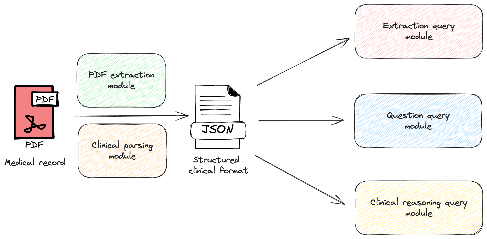
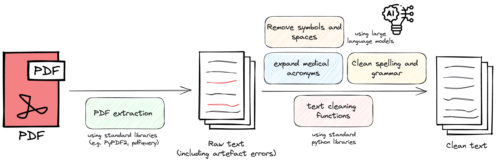

# Medical PDF Reader
An application to extract and query medical record PDFs

[](https://github.com/RichardLitt/standard-readme) [](https://github.com/chris-lovejoy/medical-pdf-reader/actions/workflows/run_pytests.yml)

---

## Table of Contents

- [About](#about)
- [Setup](#setup)
- [Usage](#usage)
- [How It Works](#how-it-works)

---

## About
The purpose of this app is to enable a user to upload a PDF of a medical record and perform two main tasks:
1. **Extract the information** from that PDF into a structured format
2. **Execute queries** (using large language models) from the information in that structured format.

---

## Setup

### Option 1: Interactive Webapp
The easiest way to interact with the app is to visit the streamlit app at [this link](https://medical-pdf-reader.streamlit.app/).


### Option 2: Running it locally
To run it locally, take the following steps:

#### 1. Install the required dependencies

Create a virtual environment. For example:
```
python3 -m venv venv
```

Activate the virtual environment
```
source venv/bin/activate
```

Install the dependencies from [requirements.txt](./requirements.txt)
```python
pip install -r requirements.txt
```


#### 2. Add your API keys to .env
The format is specified in [.env.example](.env.example).

(Note: if you don't add a hugging face API key, some of the unit tests may fail. You can prevent this by commenting out using the huggingface API import in [models.py](./src/models.py).)


#### 3. Modify models and parameters in [models.py](./src/models.py), as per preference (Optional)

<!-- TODO: consider adding a new config.py file with other considerations -->

---

## Usage

After setting up the local environment, you can either run the app via the command line or interact with it via streamlit.


### Via the command line

First, set up the configuration in [main.py](./main.py), as specified within that file. Upload a PDF that you want to interact with into the [data](./data/) directory and add it's directory to the variable `medical_record_pdf_dir`.

Once happy with the configuration, run the following command:
```
python main.py
```

The output should look something like [this](./diagrams/main-output.png).

### Running streamlit locally

You can run the streamlit app using the following command:
```
streamlit run App.py
```

You can then upload and interact with PDF documents within your browser.


### Testing

Unit tests are provided using the `pytest` framework. To run these, use the following command:

```
pytest
```

Some tests are commented out because they make API calls which cost money, in order to prevent the CI/CD pipeline becoming prohibitively expensive.

To run these tests locally, you can comment out / remnove the `@pytest.mark.skip()` statements.

In particular, [test_performance.py](./tests/test_performance.py) enables you to quantify the performance of your current model configuration on a [demo example medical record](./data/medical-record.pdf). To see more detailed reports of test performance, run:
```
pytest -s
```

---

## How It Works

The functionality is divided into several modules, as shown below:



First, the PDF is extracted into raw text. That raw text is cleaned using a combination of 'standard' text-cleaning libraries and large language models (see diagram below).

The clean version of the text is then parsed into a JSON format with relevant clinical sections (based on user configuration), which include a combination of:
- **chief_complaint**: The symptom or symptoms that brought the patient to the doctor and how they have evolved over time. Also known as the presenting complaint
- **medications**: The medications that the patient is **currently** taking.
- **allergies**: Any known medication allergies
- **family_history**: Medical conditions of all family members
- **social_history**: The patient's context and lifestyle
- **physical_examination**: The findings from performing a physical examination of the patient.
- **treatment_plan**: The step-by-step treatment plan by the doctor for the patient.



From that structured format, large language models are used to query for different information, using a variety of retrieval-based question-answer chains.
